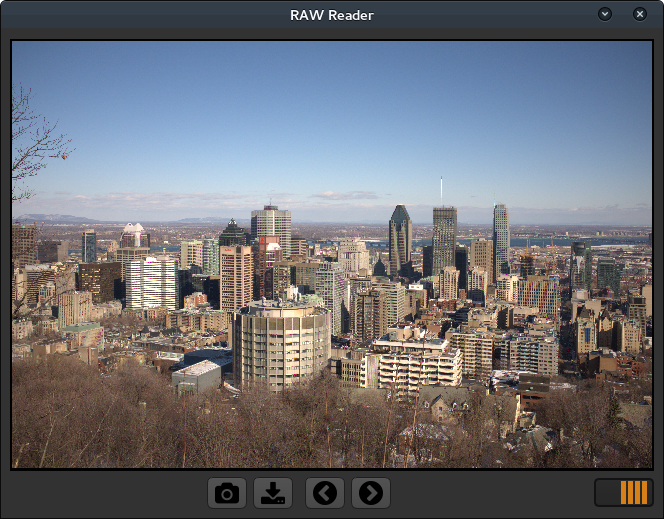

RAWr
=====
RAWr is a minimal RAW camera file reader. It started when a friend clicked images in his camera in RAW and 
I wanted to view them easily. Not knowing that Shotwell could already do it, I cooked up a small script.
It uses the `rawpy` module (based on LibRaw library) for image format conversion and PyQt for UI.
Patches are welcome.



Features
--------
You can load RAW files using camera icon and instantly save them as JPEG in same directory using the Save button. The
Right and Left arrow buttons are used to browse through other RAW files in same directory and the pulsating progress bar
indicates that there is processing going on.

TODOs
-----
* Make the display fast
* Add some minimal features like auto touching, bad pixel removal etc.
* Restructure code, better image display (window size)
* Zoom feature, thumbnails possibly?

License
-------
Code written by authors is released under LGPLv3.

Acknowledgements
----------------
Font Awesome by Dave Gandy - http://fontawesome.io  
Camera pictogram by Libberry - https://openclipart.org/user-detail/libberry  
Darkorange QStylesheet by Yasin Uludag (LoneWolf)

Requirements
------------
```
PyQt4  
rawpy  
imageio
```

Authors
-------
Suchakra